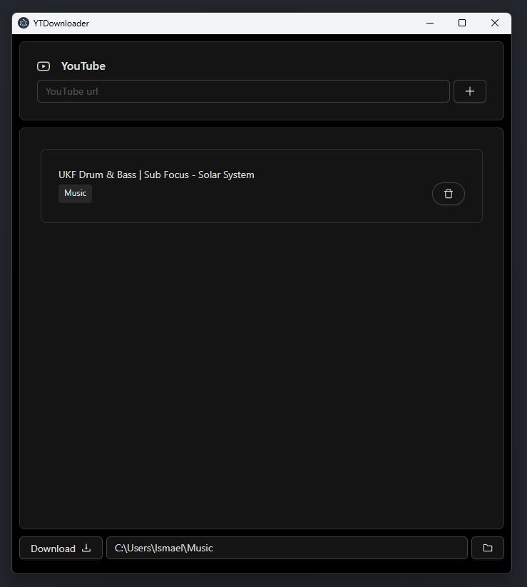

# YouTube Audio Downloader

<div align="center">
  
</div>

## Description

Desktop application for downloading audio from YouTube videos.

- Built with **Electron**, **React**, and **TypeScript**.

### Main Technologies

- **YT-dlp**: Up-to-date download engine that ensures compatibility with YouTube and other video services
- **Ant Design (antd)**: UI component framework that provides an elegant and easy-to-use interface
- **Electron Forge**: For application packaging and distribution
- **TypeScript**: Typed JavaScript code

## Features

- **Automatic YT-dlp Download**: The application automatically manages the download of the `yt-dlp.exe` executable from its official release
- **Maximum Audio Quality**: Downloads audio in the best available quality
- **Queue System**: Add multiple videos to the queue and manage your downloads efficiently

## Installation

```bash
git clone <repo-url>
cd <repo-folder>
npm install
npm start      # Run in development mode
npm run make   # Build for production
```
